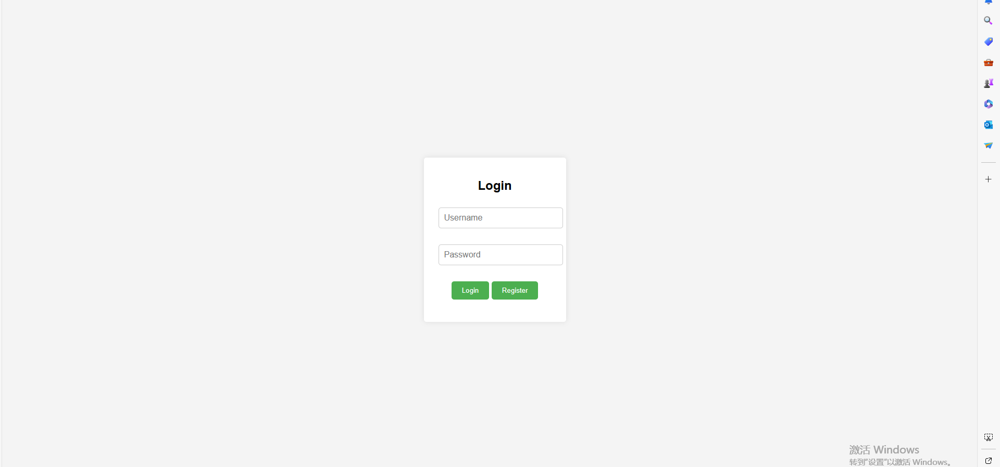
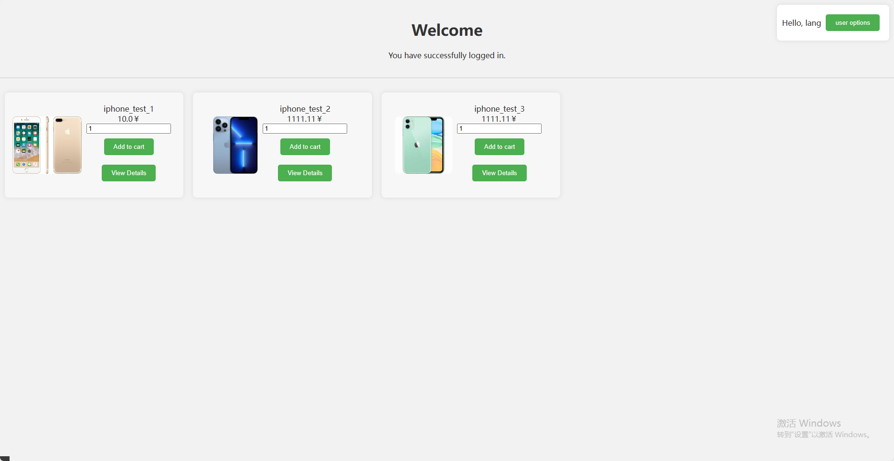
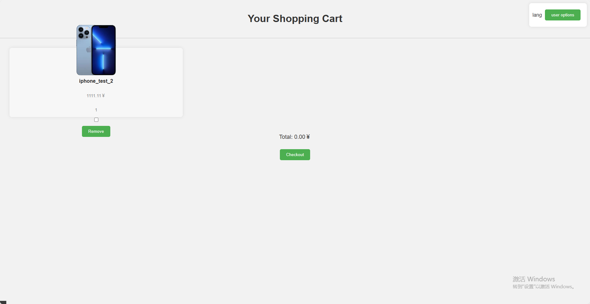
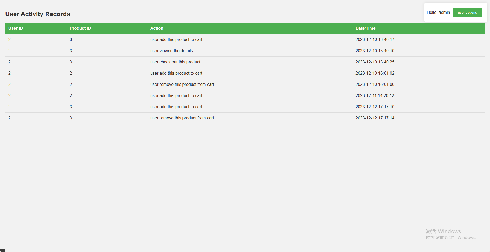
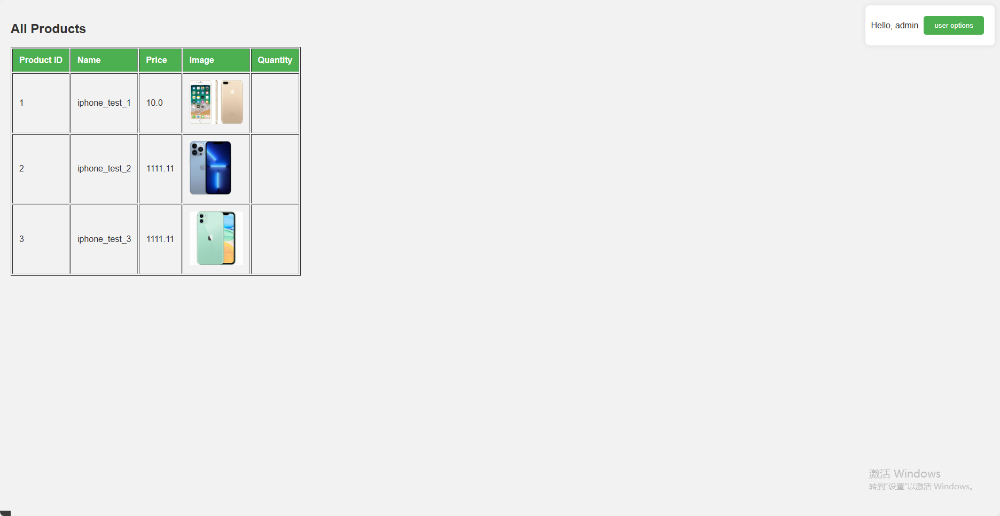

# MMS
一个基于SSM框架的电商平台管理系统

## 目录

- [环境介绍](#环境介绍)
- [使用示例](#使用示例)

## 环境介绍
#### 开发环境

| 名称      | 描述             |
| --------- |----------------|
| Java版本  | OpenJDK 20.0.1 |
| 构建工具  | Maven 3.9.2    |
| Web服务器 | Tomcat 10.1.15 |
| 数据库    | MySQL 8.0.32   |

#### 运行环境

| 名称      | 描述             |
| --------- |----------------|
| Java版本  | OpenJDK 17.0.8 |
| 构建工具  | Maven 3.6.3    |
| Web服务器 | Tomcat 10.1.15 |
| 数据库    | MySQL 8.0.35  |
| 操作系统    | Ubuntu 22.04  |

## 使用示例
进入登陆界面

输入用户名：user1 密码123456登录

或者点击注册，注册新用户

注册成功后输入账号密码登录
进入商店页面

点击view detail可查看每个商品详情

点击add to cart可将商品加入购物车

右上角进入购物车界面

点击remove可将商品移出购物车

勾选商品后check out可购买商品

右上角选择退出

输入管理员用户名admin 密码123456

进入管理员页面

此处可看到所有用户的行为记录

查看商品状态

##
202130442433 郑嘉朗